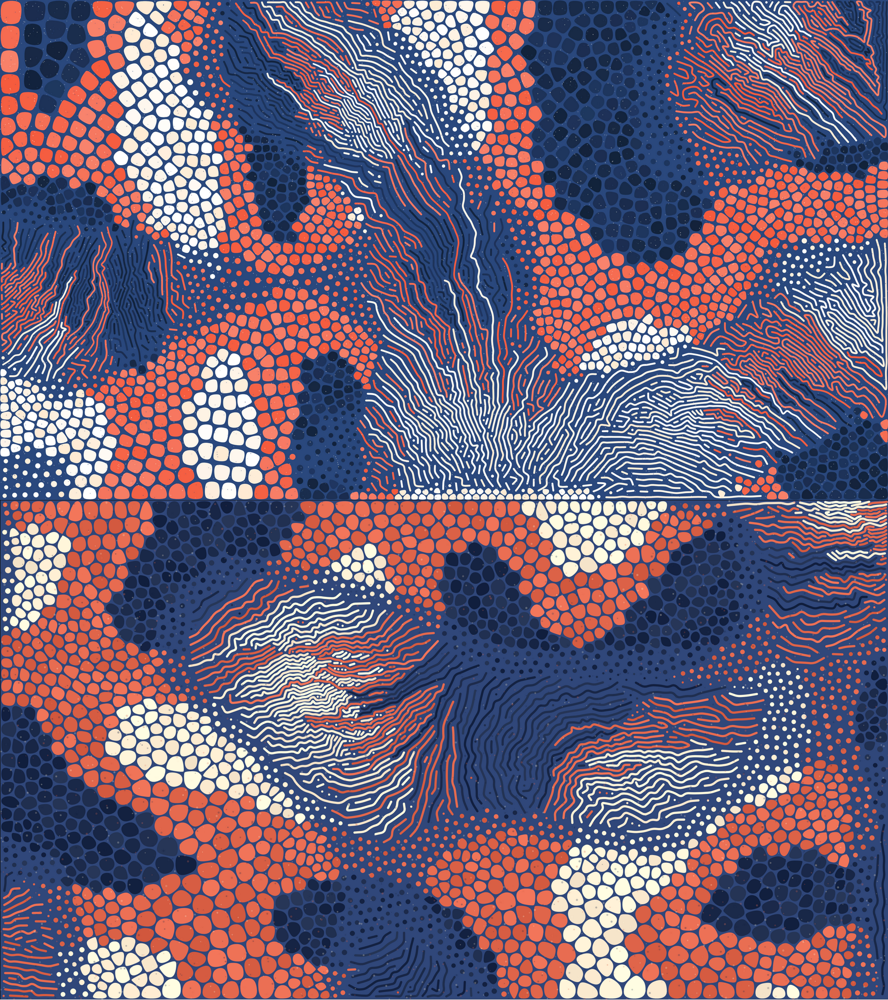
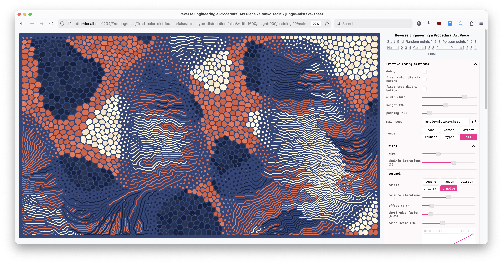

# Reverse Engineering a Procedural Art Piece

Try it live here: [muffinman.io/reverse-engineering-a-procedural-art-piece](https://muffinman.io/reverse-engineering-a-procedural-art-piece)

The repo contains the accompanying code for the presentation I gave on [Creative Coding Amsterdam Meetup](https://cca.codes/events/reverese-engineeing-a-procedural-art-piece/). I replicated [these procedural images](https://www.reddit.com/r/generative/comments/ou0bz6/some_stills_from_a_generative_svg_turing/) from scratch and took the audience through the process.

This repo is purely for educational purposes.

## Comparison 

Top is the original image from reddit, the bottom is generated using the tool I've created

[](https://muffinman.io/reverse-engineering-a-procedural-art-piece)

## Setup

### First time:

Install node v24.3.0, for example using `nvm` :

```sh
nvm install v24.3.0
nvm use
```

Install dependencies:

```sh
npm install
```

### Development:

```sh
nvm use # to select the correct node version

npm start
```

Open [localhost:1234](http://localhost:1234/)

You should see this page:


For a start focus on [generate.ts](./src/drawing/generate.ts) and [render.ts](./src/drawing/render.ts).

If you want to reset the parameters, just click on the "Final" link.

## Concepts and libraries used

### Noise

- [Noise vs Random](https://codepen.io/stanko/pen/jErgrzJ?editors=0010) interactive example
- [Perlin noise](https://en.wikipedia.org/wiki/Perlin_noise) on Wikipedia
- [Simplex noise](https://github.com/jwagner/simplex-noise.js) (Perlin noise successor) JavaScript package
- [Noise in Thee Book of Shaders](https://thebookofshaders.com/11/)

### Voronoi

- [Voronoi diagram](https://en.wikipedia.org/wiki/Voronoi_diagram) on Wikipedia
- [Interactive example on codepen](https://codepen.io/stanko/full/QwEVGEv)
- [Interactive playground](https://alexbeutel.com/webgl/voronoi.html)
- [JavaScript library](https://github.com/gorhill/Javascript-Voronoi) 
- [Lloyd's algorithm](https://en.wikipedia.org/wiki/Lloyd%27s_algorithm)
- [Voronoi in The Book of Shader](https://thebookofshaders.com/12/)
- [Example with Manhattan distance](http://www.sygreer.com/projects/voronoi/)

### Other

- [Poisson disk sampling](https://github.com/kchapelier/poisson-disk-sampling) JavaScript library
- [Chaikin's curves](https://observablehq.com/@pamacha/chaikins-algorithm) intro and interactive example
- [OKLCH](https://oklch.com/) color space
- [HSLuv](https://www.hsluv.org/) color space
